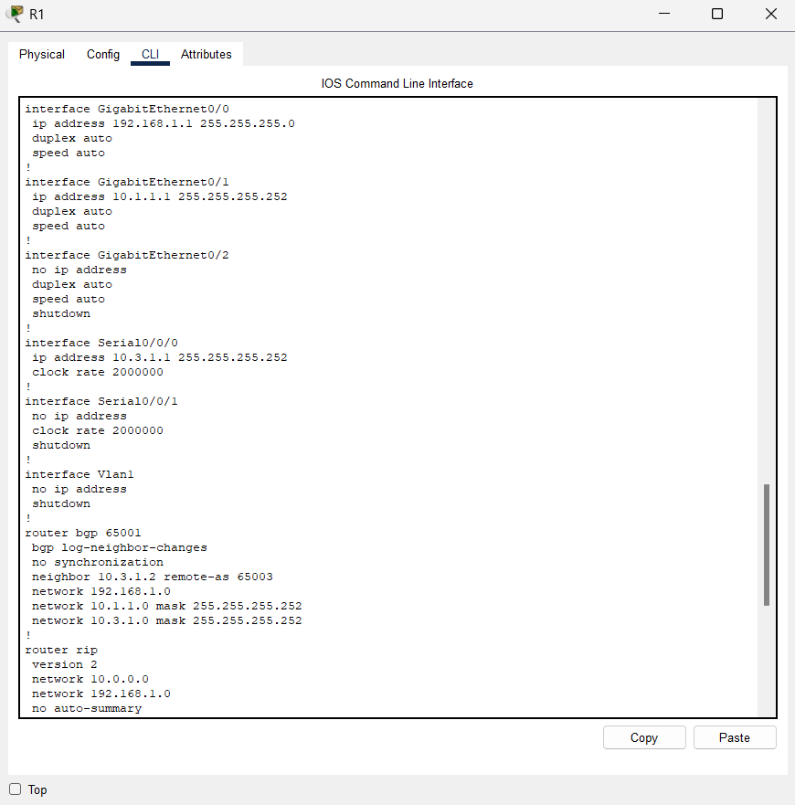
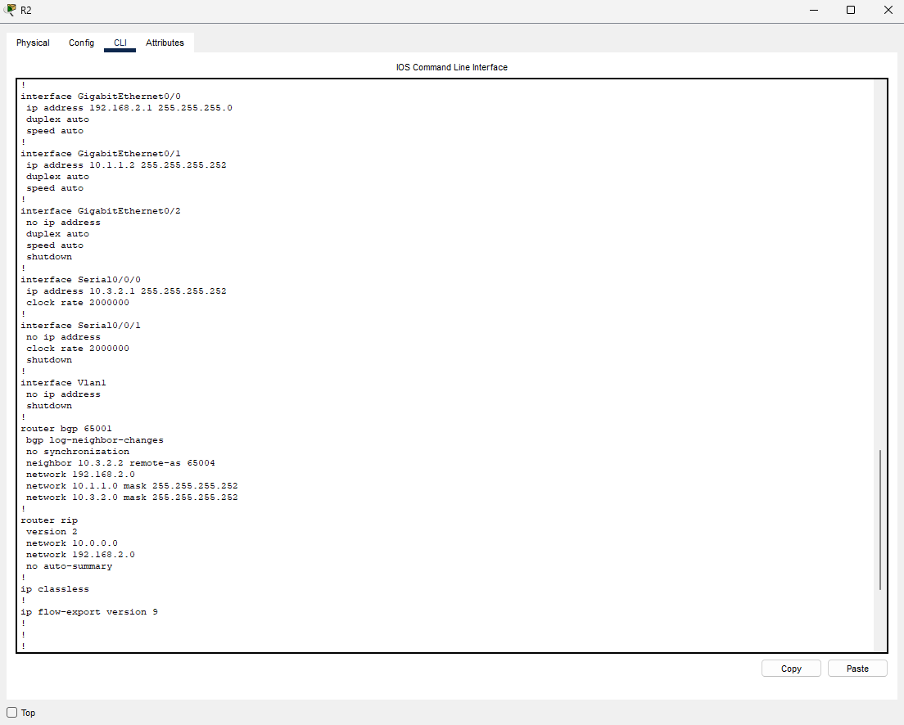
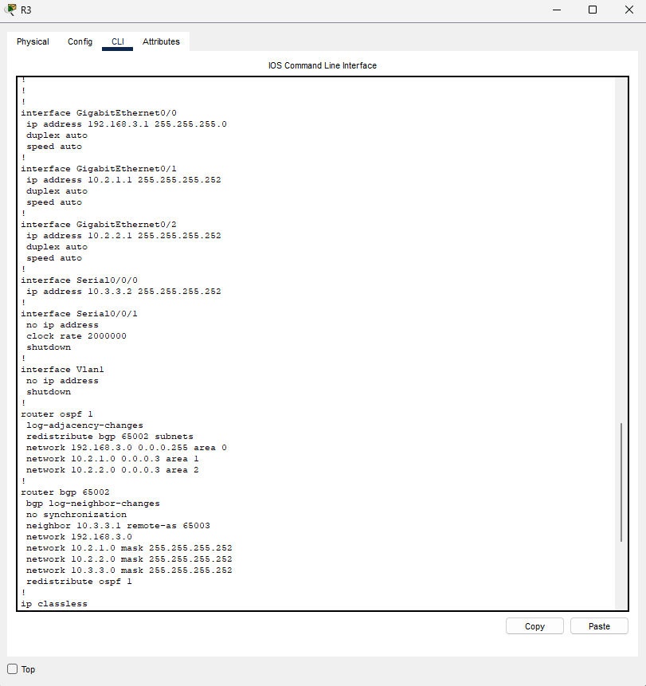
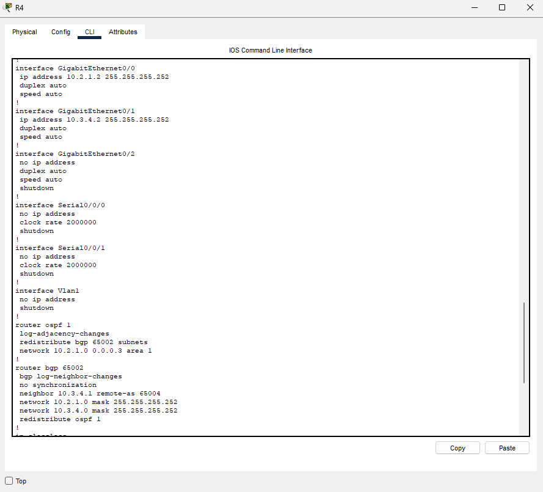
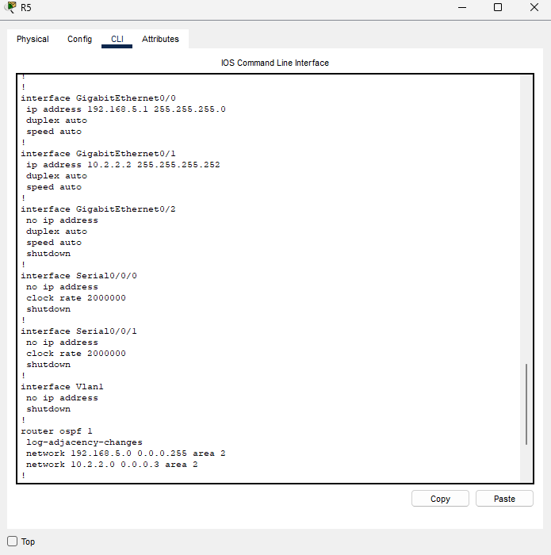
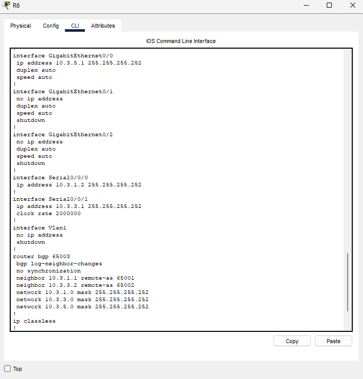
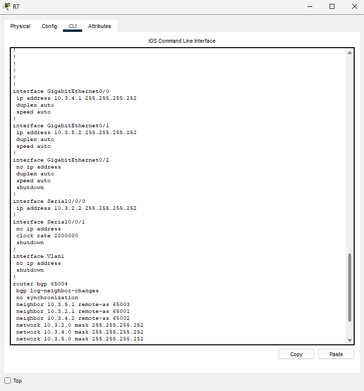

# Relatório do Projeto Final - Redes Convergentes

## 1. Contexto e objetivos
- Trabalho em dupla avaliado na 3ª atividade, com entrega do arquivo do Packet Tracer e relatório conforme enunciado do PDF `trabalho final 2025-2 redes.pdf`.
- Tecnologias obrigatórias: roteamento dinâmico com RIP, OSPF e BGP; serviços de DHCP e VoIP (Cisco CME); capacidade de explicar comandos e escolhas de topologia.
- Objetivos de aprendizagem atendidos: configuração e integração dos protocolos, interligação entre AS distintos, e validação de conectividade entre hosts.

## 2. Visão geral da topologia
- Três Sistemas Autônomos interligados:
  - **AS 65001 (RIP)**: R1 e R2, LANs 192.168.1.0/24 e 192.168.2.0/24, enlace interno 10.1.1.0/30.
  - **AS 65002 (OSPF)**: R3 (Área 0/ABR), R4 (Área 1), R5 (Área 2); enlaces internos 10.2.1.0/30 (Área 1) e 10.2.2.0/30 (Área 2); LANs 192.168.3.0/24 e 192.168.5.0/24.
  - **AS 65003 / AS 65004 (BGP de borda)**: R6 (65003) liga AS 65001-65002; R7 (65004) faz peering com R2 (65001), R4 (65002) e R6 (65003).
- Serviços adicionais na borda do AS 65001: roteador de voz (CME) em 192.168.1.100/24 atendendo a mesma LAN do R1.
- Evidências visuais disponíveis nos prints, por exemplo `Topologia Geral.png` (desenho completo) e `Vizinhança-BGP-*.png` (peers BGP).

## 3. Endereçamento e papéis por equipamento
### AS 65001 - RIP
- **R1** (`### R1 - Principais Configurações.txt`):  
  - G0/0 192.168.1.1/24 (LAN dados/voz), G0/1 10.1.1.1/30 (para R2), S0/0/0 10.3.1.1/30 (para R6).  
  - RIP v2 em 192.168.1.0, 10.1.1.0, 10.3.1.0; BGP 65001 com neighbor 10.3.1.2 (R6/AS65003), anuncio 192.168.1.0 e redistribuição do RIP.  
  - DHCP `VOICE` na LAN 192.168.1.0 com option 150 apontando para 192.168.1.1.
  - Prints: 
- **R2** (`### R2 - Roteador RIP (AS 65001).txt`):  
  - G0/0 192.168.2.1/24, G0/1 10.1.1.2/30 (para R1), S0/0/0 10.3.2.1/30 (para R7).  
  - RIP v2 para 10.0.0.0 e 192.168.2.0; BGP 65001 com neighbor 10.3.2.2 (R7/AS65004), anúncios 192.168.2.0, 10.1.1.0/30 e 10.3.2.0/30.
  - Prints: 

### AS 65002 - OSPF
- **R3 (Área 0/ABR)** (`### R3 - Roteador OSPF.txt`):  
  - G0/0 192.168.3.1/24 (Área 0), G0/1 10.2.1.1/30 (Área 1), G0/2 10.2.2.1/30 (Área 2), S0/0/0 10.3.3.2/30 (para R6).  
  - OSPF 1 com redes em suas áreas; redistribui BGP 65002. BGP 65002 com neighbor 10.3.3.1 (R6/AS65003), anúncios das redes internas e redistribuição do OSPF.
  - Prints: 
- **R4 (Área 1)** (`###R4 - Roteador OSPF Área 1  BGP AS 6.txt`):  
  - G0/0 10.2.1.2/30 (Área 1), G0/1 10.3.4.2/30 (para R7).  
  - OSPF 1 anunciando 10.2.1.0/30; BGP 65002 com neighbor 10.3.4.1 (R7/AS65004), anúncios 10.2.1.0/30 e 10.3.4.0/30; redistribuição OSPF<->BGP.
  - Prints: 
- **R5 (Área 2)** (`###R5 - Roteador OSPF Área 2.txt`):  
  - G0/0 192.168.5.1/24 (LAN Área 2), G0/1 10.2.2.2/30 (link para R3).  
  - OSPF 1 anunciando 192.168.5.0/24 e 10.2.2.0/30 na Área 2.
  - Prints: 

### AS 65003 / AS 65004 - BGP de borda
- **R6 (AS 65003)** (`R6 - Roteador BGP (AS 65003).txt`):  
  - S0/0/0 10.3.1.2/30 (para R1/AS65001), S0/0/1 10.3.3.1/30 (para R3/AS65002), G0/0 10.3.5.1/30 (para R7/AS65004).  
  - BGP 65003 com neighbors 10.3.1.1 (AS65001) e 10.3.3.2 (AS65002); anúncios das três redes ponto-a-ponto. *(Observação: para formar sessão com o R7/AS65004 seria preciso adicionar neighbor 10.3.5.2 remote-as 65004, caso desejado.)*
  - Prints: 
- **R7 (AS 65004)** (`R7 - Roteador BGP (AS 65004).txt`):  
  - S0/0/0 10.3.2.2/30 (para R2/AS65001), G0/0 10.3.4.1/30 (para R4/AS65002), G0/1 10.3.5.2/30 (para R6/AS65003).  
  - BGP 65004 com neighbors 10.3.2.1 (AS65001), 10.3.4.2 (AS65002) e 10.3.5.1 (AS65003); anúncios das três redes de enlace.
  - Prints: 

### Roteador de Voz (CME)
- **R-VoIP** (`R-VoIP - Roteador VoIP (DHCP, RIP,.txt`):  
  - Fa0/0 192.168.1.100/24 servindo a LAN de voz/dados; DHCP `VOICE` com gateway 192.168.1.100 e option 150 apontando para o próprio roteador.  
  - RIP v2 anunciando 192.168.1.0/24 para integração com R1.  
  - Cisco CME com 4 ramais (2000-2003) e `ip source-address 192.168.1.100 port 2000`; um ephone pré-cadastrado (MAC 0001.C762.EAB0) do tipo 7960. Print `show ephone.png` registra o estado dos telefones.

## 4. Protocolos e redistribuição
- **RIP (AS 65001)**: Versão 2, sem sumarização automática; R1 anuncia LAN 192.168.1.0 e links 10.1.1.0/30 e 10.3.1.0/30; R2 anuncia 192.168.2.0/24 e 10.1.1.0/30. R1 redistribui o RIP no BGP 65001 para exportar rotas internas ao AS 65003.
- **OSPF (AS 65002)**: Área 0 no R3 (com LAN 192.168.3.0/24), Área 1 entre R3-R4 (10.2.1.0/30) e Área 2 entre R3-R5 (10.2.2.0/30 e LAN 192.168.5.0/24). R3 e R4 redistribuem BGP<->OSPF, permitindo anúncio das redes OSPF no BGP 65002.
- **BGP (inter-AS)**:  
  - AS 65001: R1 faz peering com R6 (AS65003), anunciando 192.168.1.0/24 e redistribuição do RIP; R2 faz peering com R7 (AS65004), anunciando 192.168.2.0/24 e links internos.  
  - AS 65002: R3 (para R6/AS65003) e R4 (para R7/AS65004) exportam redes OSPF.  
  - AS 65003: R6 recebe rotas dos AS 65001 e 65002 e publica os enlaces 10.3.1.0/30, 10.3.3.0/30 e 10.3.5.0/30.  
  - AS 65004: R7 agrega conectividade extra entre 65001, 65002 e 65003.  
  - Prints `Vizinhança-BGP-*.png` documentam o estabelecimento das sessões.
- **Pontos de atenção**: (1) garantir a sessão BGP R6<->R7 se for necessária para redundância pelo enlace 10.3.5.0/30; (2) evitar sobreposição de serviços DHCP na LAN 192.168.1.0/24 escolhendo apenas um servidor (R1 ou R-VoIP) para distribuição de IPs/option 150.

## 5. Serviços de rede
- **DHCP**:  
  - R1: pool `VOICE` 192.168.1.0/24 com option 150 em 192.168.1.1.  
  - R-VoIP: pool `VOICE` 192.168.1.0/24 com gateway e option 150 em 192.168.1.100; exclui 192.168.1.1-192.168.1.99.  
  - Recomenda-se manter apenas o servidor do R-VoIP ativo para voz, deixando o de R1 desativado ou ajustado para outra sub-rede/dados.
- **VoIP (CME)**: 4 ramais (2000-2003) auto-atribuídos, um telefone 7960 pré-registrado; `telephony-service` limitado a 4 ephones/dial-peers, adequado para laboratório. Arquivo `show ephone.png` confirma o provisionamento.
  - Print: 

## 6. Testes e evidências de funcionamento
- **Conectividade entre AS**: capturas `Teste-PC1 para PC5.png`, `Teste-PC2 para PC7.png` e `Teste-PC4 para PC8.png` registram pings entre hosts de AS diferentes, demonstrando troca de rotas entre RIP, OSPF e BGP.
- **Protocolos ativos**: `show ip protocols R1.png` evidencia RIP ativo e (via configuração) redistribuição para BGP. Tabelas de roteamento (`R1-tabela de roteamento IPv4.png`, `R3-tabela de roteamento IPv4.png`) mostram aprendizado dinâmico nas três pilhas de roteamento.
- **BGP**: `Vizinhança-BGP-R1.png` a `Vizinhança-BGP-R4.png` registram as sessões de peering por AS e os estados de vizinhança.
- **VoIP**: `show ephone.png` verifica o status dos telefones IP cadastrados pelo CME.
- Sugestão de checagens rápidas adicionais: `ping` entre todos os pares de LAN (192.168.1.0, .2.0, .3.0, .5.0), `traceroute` para confirmar o caminho via AS, `show ip bgp summary` em R6/R7 para validar as sessões, e `show ip dhcp binding` no servidor ativo da LAN 192.168.1.0/24.

## 7. Conclusão
- A topologia integra RIP (AS 65001), OSPF multiárea (AS 65002) e BGP entre AS, conforme os objetivos do projeto.
- Os serviços de DHCP e VoIP (CME) estão configurados e documentados, incluindo opção 150 e ramais provisionados.
- As sessões BGP apresentam vizinhanças estabelecidas e anúncios das rotas internas, conforme os prints de peering.
- Os testes de conectividade entre PCs de diferentes AS comprovam a troca de rotas e a comunicação fim a fim pelas três pilhas de roteamento.
